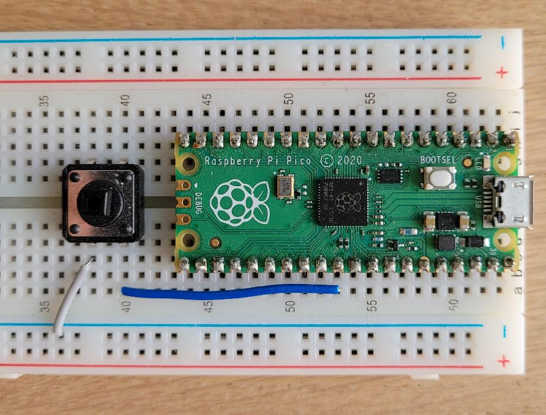

# PicoFiFun

(**WIP**) Fault injection CTFs with Raspberry Pi Pico, mainly for learning Pico C SDK.

## Setup

[Here](https://www.electronicshub.org/program-raspberry-pi-pico-using-c/) is a good reference for setting up [pico-sdk](https://github.com/raspberrypi/pico-sdk).

The basic steps are the following:

1. Clone the pico-sdk repository and submodules (tinyusb):  
    ```bash
    git clone -b master https://github.com/raspberrypi/pico-sdk.git
    cd pico-sdk
    git submodule update – -init
    ```

2. Install the toolchain (1.8 GB, takes time and space):
    ```bash
    sudo apt update
    sudo apt install cmake gcc-arm-none-eabi libnewlib-arm-none-eabi build-essential
    ```

3. Export the `pico-sdk` path as environmental variable:
    ```bash
    export PICO_SDK_PATH=/home/pi/pico/pico-sdk # changeme
    ```

4. For convenience, create a directory called `projects` in the same directory as `pico-sdk`, where you will copy-paste the `*_src` directory of each writeup.

**Note**: pico-sdk uses CMake to create Make files. For a tidy setup, in each `*_src` directory (e.g. `glitch_src`) create a `build` directory where all such files will be created (`build` folders are already there sometimes).

5. For compilation, enter the specific project's `build` directory and run the following:
    ```bash
    cmake ..
    make -j4 # change number of sim jobs accordingly
    ```
    This will produce .bin, .hex, .elf and .uf2 files.

6. For easy loading of the firmware onto the Pico, I wired up a button to the reset pin (pin 30).  


By pressing the "reset" + "BOOTSEL" buttons, then releasing the reset button, the Pico appears as USB storage device (BOOTSEL can be released then).  
The .uf2 file can be copied in the folder, then the Pico restarts and begins running the firmware.

### Writeups

- [Rhme2016-Fiesta](./rhme2016_fiesta)